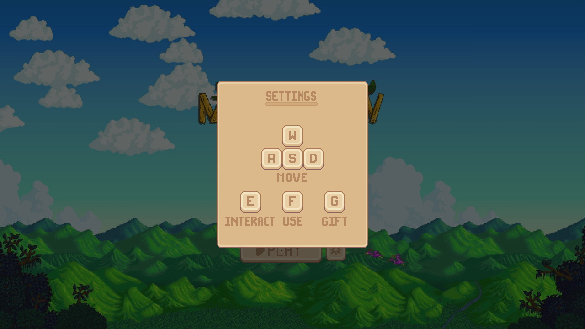

# 🌙 Moondew Valley

A Stardew Valley–inspired farming and life-simulation game built using Pygame as part of my ICS3U1 culminating assignment. This game features farming, exploration, NPC interaction, and a time-based gameplay system in a 2D tile-based world.

## 📸 Screenshots
<p align="center">
  
  
  
  
</p>

## 🎮 Key Features
- **Day/Night System**: Time-based progression with an in-game clock and day counter.
- **Interactable NPCs** with day-based dialogue, quests, and relationship-based gifting mechanics.
- **Farming Mechanics**: Crop planting, growth cycles, and harvesting.
- **Inventory System**: Item storage and management for crops and tools.
- **Tile-Based World**: 2D map with collision detection and spatial boundaries.
- **Player Controls**: Grid-based movement and object interaction.
- **Custom Assets**: Custom sprites and UI elements.


## 🛠️ Tech Stack
**Language:**
- Python

**Game Engine:**
- Pygame

## 🚀 How to Run
### Prerequisites
- Python 3.x
- Pygame
### Installation
```bash
pip install pygame
git clone https://github.com/your-username/moondew-valley.git
cd moondew-valley
```
Run the game
```bash
python main.py
```

## ⚙️ How It Works
- **Game Loop:** Handles input processing, state updates, and rendering.
- **Time System:** Advances in-game time and triggers day-based events.
- **Entity Management:** NPCs, crops, and player states update based on time and interaction.
- **Interaction Flow:** Player actions trigger dialogue, inventory updates, or quests.

## 🧠 What I Learned
- **Object-Oriented Design**: Structuring game entities using classes and inheritance.
- **State Management**: Coordinating time, inventory, and NPC behavior.
- **Collision & Event Handling**: Managing player movement and world boundaries.
- **Game Architecture**: Building scalable systems for simulation-style gameplay.

## 📚 Project Context
This project was developed as the culminating assignment for the ICS3U1 high school computer science course. It demonstrates foundational programming concepts, game architecture, and interactive system design.

## ⚠️ Disclaimer
Moondew Valley is a fan-made student project inspired by Stardew Valley.  
This project is for educational purposes only and is not affiliated with or endorsed by the original creators.

## 👤 Author
Created by Tracy Su  
ICS3U1 — Computer Science  
Milliken Mills High School  